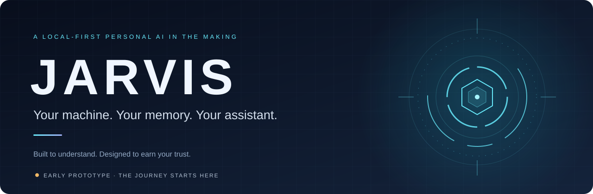
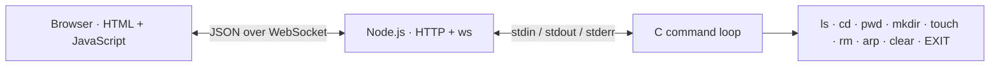
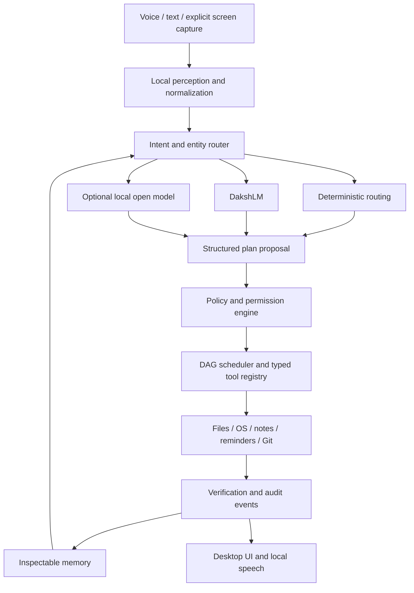

<div align="center">



**Building a personal AI assistant that lives on your computer.**  
Local voice. Inspectable memory. Actions you approve. A small language model trained from scratch.

[](#progress)
[](PLAN.md)
[](#the-vision)
[](LICENSE)

[The vision](#the-vision) · [Try it](#quick-start) · [Progress](#progress) · [Architecture](#architecture) · [Build plan](PLAN.md)

</div>

---

> [!NOTE]
> **Today:** a local browser-to-process prototype: HTML → session-checked WebSocket → Node.js → C, with a small set of built-in file and system commands.
> **The destination:** a local personal assistant with speech, memory, models, and controlled automation. Those capabilities are planned, not implemented yet.

## The vision

Imagine sitting down at your laptop and saying, **“Jarvis, start a study session.”** Your assistant finds the right notes, lets you choose a file, starts a timer, and records the session. You can see the plan, follow each action, and understand what it remembered.

That is the JARVIS being built here: an assistant that knows useful context, works on your own hardware, and keeps you in control of what happens next.

The [39-week build plan](PLAN.md) follows one principle:

**Understand → build a miniature version → measure it → replace only when production quality requires it.**

> **JARVIS will not be vibe coded.** Production feature code will be written by hand, with every component understood, tested, and explainable by its author. AI assistance is limited to learning support: hints, documentation pointers, explanation reviews, and adversarial test cases—not generating production features. This commitment is part of the [build plan](PLAN.md#your-rules-about-ai-assistance).

The journey includes systems programming, audio processing, neural networks, a transformer trained from random weights, and the engineering needed to bring them together. The normal operating path is designed to require **no paid AI API**. Compute, storage, electricity, and model downloads still have real costs.

### What JARVIS is being built to do

| Capability | The intended experience |
| :--- | :--- |
| **Hear and speak locally** | Push-to-talk, an experimental trained wake word, local transcription, and spoken replies. |
| **Understand useful requests** | At least 25 tested intents, entity extraction, and clarification when a request is ambiguous. |
| **Remember with context** | Working, episodic, semantic, and procedural memory that you can inspect, correct, and delete. |
| **Act with permission** | Typed tools, explicit capabilities, previews for risky actions, and an audit trail. |
| **Finish multi-step jobs** | Plans with dependencies, timeouts, retries, cancellation, and visible partial failures. |
| **Show its work** | A desktop interface for transcripts, plans, active tools, permissions, retrieved memories, and results. |

### Five workflows worth building for

These are **planned acceptance scenarios**, not commands supported by the current prototype.

| You ask | JARVIS should |
| :--- | :--- |
| “Start a study session.” | Find and rank notes → open your selection → start a timer → create a session note. |
| “Check this project.” | Inspect Git changes and tests → summarize the state → suggest a next action. |
| “What is taking up space?” | Inspect storage and processes → explain cleanup candidates → leave deletion to you. |
| “Prepare my latest document.” | Locate an approved document → copy to a safe output → convert locally if available → verify. |
| “Why did we make that decision?” | Retrieve a stored project decision → show its source and confidence → let you correct or forget it. |

## Quick start

The current prototype needs **Node.js with npm, GCC, Git, and a browser**. No model download, microphone, GPU, or API key is needed for this stage.

### Ubuntu / Linux

With the prerequisites installed, run:

```bash
git clone https://github.com/DakshVDharmani/Jarvis.git
cd Jarvis/backend
npm ci
gcc shell.c -o shell
node server.js
```

Open **[http://localhost:3000](http://localhost:3000)**. Enter a command in the input field and press **Enter**.

Run the server from `backend/`: the executable and frontend paths are resolved relative to that directory. On Windows, you can use the Linux instructions inside an Ubuntu WSL environment with Linux Node.js and GCC installed there.

<details>
<summary><strong>Native Windows development</strong></summary>

The repository includes `backend/shell.exe`. To build from source with a compatible MinGW toolchain, use the following from `backend/`:

```powershell
npm ci
gcc shell.c -o shell.exe
node server.js
```

The C source uses `unistd.h` and `dirent.h`, so it needs a toolchain that supplies those headers. Native Windows feature parity is a later roadmap goal; Ubuntu is the primary target for the planned assistant.

</details>

### Try the commands that exist today

| Command | Behavior |
| :--- | :--- |
| `ls` | List non-hidden entries in the current directory. |
| `ls ..` | List non-hidden entries in the parent directory. |
| `cd ..` | Change the C process's working directory to its parent. |
| `cd backend` | Enter a directory relative to the current location. |
| `cd` | Change to the directory in `HOME`, when that variable is available. |
| `pwd` | Print the C process's current working directory. |
| `mkdir <name>` | Create a directory. |
| `touch <name>` | Create a file if it does not exist. |
| `rm <name>` | Delete a file. There is no confirmation or recovery mechanism. |
| `arp` | Run the host's `arp -a` command and print its output. |
| `clear` | Clear the browser terminal output. |
| `EXIT` | End this connection's C command loop; uppercase is required. |

Each browser connection starts its own C process. The Node.js server generates a random secret at startup, injects it into the page it serves, and requires that secret in each WebSocket message. The server listens only on `127.0.0.1`. The prompt includes its current directory. Unknown commands return `Command not found: <command>`; this is a small built-in command loop with space-delimited arguments. Quoted paths, pipes, redirection, and arbitrary system commands are not implemented.

After `EXIT`, refresh the page to start a new session. Stop the Node.js server with **Ctrl+C** in the terminal where you launched it.

> [!IMPORTANT]
> The server is loopback-only and uses a startup session secret, which prevents ordinary network access and rejects WebSocket messages that do not carry the current secret. This is not a permission system: there is no user authentication, command authorization, filesystem sandbox, path allowlist, confirmation flow, or audit log. `cd`, `ls`, `mkdir`, `touch`, and `rm` operate with the server process's OS permissions; `rm` deletes immediately. Use it only as a local development prototype and do not treat the session secret as a security boundary against other software running on the same machine.

<details>
<summary><strong>Troubleshooting</strong></summary>

| Symptom | What to check |
| :--- | :--- |
| `Cannot find module 'ws'` | Run `npm ci` inside `backend/`. |
| `spawn ./shell ENOENT` | Compile `shell.c` for your OS and start Node from `backend/`. |
| `Could not load index.html` | Start from `backend/` and confirm `frontend/index.html` exists. |
| `EADDRINUSE` | Port 3000 is already occupied; stop the process using it before retrying. |
| Commands stop responding after `EXIT` | Refresh the page to create a new command process. |
| Output appears crowded | The current HTML output uses ordinary whitespace rendering; terminal formatting is still pending. |

</details>

## Progress

**Checked means implemented in the current source.** Unchecked items are planned. This checklist tracks repository capabilities, not elapsed weeks or completed roadmap gates.

### Built so far

- [x] Browser page with a command input and output area.
- [x] Node.js HTTP server serving the frontend on port 3000.
- [x] JSON messages over a WebSocket connection.
- [x] Loopback-only server binding and a per-startup WebSocket session secret.
- [x] A dedicated C command process for each connected browser.
- [x] Browser input forwarded to the process's standard input.
- [x] Standard output and standard error forwarded back to the browser.
- [x] Command history with Up/Down arrow navigation in the browser terminal.
- [x] `ls`, `cd`, `pwd`, `mkdir`, `touch`, `rm`, `arp`, `clear`, `EXIT`, current-directory prompts, and unknown-command feedback.
- [x] Child-process termination when a browser connection closes.
- [x] A detailed six-phase build plan with acceptance gates.

### Still to build

- [ ] Typed Python core, configuration, structured events, and diagnostic CLI.
- [ ] Validated tool registry, capability checks, confirmations, and audit logging.
- [ ] Automated tests, CI, timeouts, cancellation, and recovery handling.
- [ ] Local audio pipeline, push-to-talk, wake-word training, speech-to-text, and text-to-speech.
- [ ] Intent classifier and entity extraction covering at least 25 tested intents.
- [ ] `DakshLM`: tokenizer, transformer, training pipeline, checkpoints, and evaluation.
- [ ] Optional local open-weight model adapter through `llama.cpp`.
- [ ] Persistent, searchable memory with retention and forget controls.
- [ ] Scoped plugins for files, system status, apps, notes, reminders, and Git.
- [ ] Multi-step planner and the five flagship workflows.
- [ ] React/TypeScript desktop UI with plans, permissions, memory, and tool activity.
- [ ] Explicit screen capture and local OCR with privacy controls.
- [ ] Clean-install demo, benchmarks, threat model, model card, and JARVIS 1.0 release.

## Architecture

### Running today



This prototype explores the communication path from a browser to a native process. The planned assistant builds on those lessons with a Python core and a separate permission boundary.

### Planned for JARVIS 1.0



**Models propose; code decides.** Model output must pass validation and permission checks before any tool runs. The design calls for default-deny capabilities, separate read/write permissions, exact-target confirmations for destructive actions, and untrusted treatment of tool output.

### Two local brains, different jobs

| | `DakshLM` | `LocalOpenModel` |
| :--- | :--- | :--- |
| **Purpose** | Learn and demonstrate the mechanics of language modeling. | Give the assistant stronger natural-language ability. |
| **Approach** | A tokenizer and decoder-only transformer trained from random weights. | An optional open-weight model served locally through `llama.cpp`. |
| **Scope** | Roughly **10–50 million parameters**, a small usable training corpus, and measured limitations. | Model selection and quantization matched to available hardware. |
| **Machine access** | Structured proposals only. | Structured proposals only. |
| **Status** | Planned. | Planned. |

`DakshLM` is a research-scale model. Its success will be judged through reproducible experiments, held-out evaluation, and a documented comparison with the optional local model.

### Stack: now and next

| Layer | Current implementation | Planned direction |
| :--- | :--- | :--- |
| Interface | HTML + vanilla JavaScript | React + TypeScript + Vite; desktop packaging |
| Backend | Node.js HTTP + `ws` | Python 3.12+ core, typed local API, WebSocket events |
| Execution | C built-ins over standard I/O | Validated tools, permission engine, DAG scheduler |
| Storage | No persistent application store | SQLite, full-text search, inspectable memory |
| Intelligence | Exact command matching | Rules and classical ML → `DakshLM` + optional local model |
| Audio | Not implemented | Local Whisper-compatible STT and Piper-compatible/OS TTS |

## Roadmap

The plan spans **39 weeks**, with a target of **12–15 focused hours per week**. These are planned work windows, not a release-date promise. Each phase advances when its acceptance gate passes.

| Phase | Weeks | Exit milestone |
| :--- | :---: | :--- |
| **I · Foundations** | 1–6 | Tested deterministic CLI, tools, and permission kernel. |
| **II · Voice and language** | 7–12 | Local speech pipeline, trained wake-word experiment, and intent router. |
| **III · Build the brain** | 13–19 | Trained and evaluated `DakshLM`, exposed through a local adapter. |
| **IV · Memory and trust** | 20–26 | Durable memory, scoped plugins, and adversarial security tests. |
| **V · Plans and presence** | 27–33 | Five multi-step workflows, desktop UI, and explicit screen perception. |
| **VI · Prove it works** | 34–39 | Recovery tests, benchmarks, clean-install demo, and documented 1.0. |

**[Read the complete build plan →](PLAN.md)** for weekly tasks, gate criteria, curriculum, risks, and evaluation strategy.

V1 focuses on a local, single-user assistant. Unrestricted autonomous browsing or shell access, unconfirmed purchases or messages, voice cloning, mobile apps, smart-home hardware, and simultaneous Linux/Windows parity are outside its scope.

## Explore the source

```text
Jarvis/
├── backend/
│   ├── server.js          # HTTP server, WebSocket bridge, child-process lifecycle
│   ├── shell.c            # Native command parser and built-ins
│   ├── shell.exe          # Included Windows executable
│   ├── package.json       # Node dependency: ws
│   └── package-lock.json  # Locked dependency tree
├── frontend/
│   └── index.html         # Command input, WebSocket client, output display
├── docs/assets/           # README artwork
├── PLAN.md                # The full 39-week specification
├── README.md
└── LICENSE
```

To follow one command through the system, start at [`frontend/index.html`](frontend/index.html), follow the message into [`backend/server.js`](backend/server.js), then read the parser and built-ins in [`backend/shell.c`](backend/shell.c).

## Build along

JARVIS is a learning-driven project by **[Daksh Dharmani](https://github.com/DakshVDharmani)**. Contributions that make the system easier to understand, reproduce, and verify fit that purpose.

Read [the plan](PLAN.md), then [open an issue](https://github.com/DakshVDharmani/Jarvis/issues) to discuss a focused improvement. Useful early work includes command-parser edge cases, readable terminal output, connection/process error handling, and reproducible setup checks. Pull requests should explain the behavior changed and how it was checked. Keep the progress checklist aligned with the code.

## License

JARVIS is licensed under the **[GNU Affero General Public License v3.0](LICENSE)**.

---

<div align="center">

**From the first command to an assistant you understand.**

[Explore the code](backend/shell.c) · [Follow the roadmap](PLAN.md) · [Suggest an improvement](https://github.com/DakshVDharmani/Jarvis/issues)

</div>
